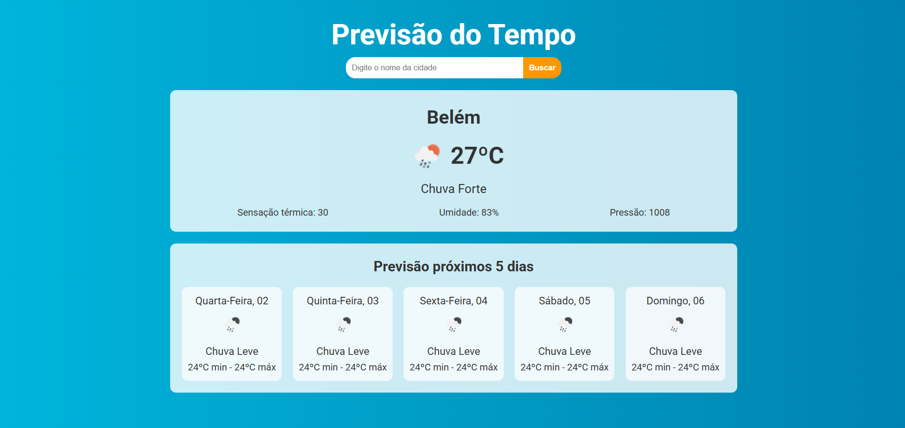

# Página de previsão do tempo  

Aplicação FrontEnd para consumo de API de informações  meteorológicos

### Descrição
<hr>
Receba informações de previsão do tempo do dia atual e dos próximos 5 dias.

### Como funciona?
<hr>
Basta inserir na barra pesquisa a cidade de sua escolha e clicar em buscar.

### Instalação
<hr>

Clone o repositório
```bash
https://github.com/leandrovelosos/previsaodotempo
```
Instale as dependencias
```bash
npm i
```
Instale o axios
```bash
npm i axios
```
Execute o projeto
```bash
npm run dev
```

